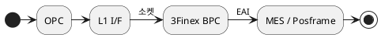
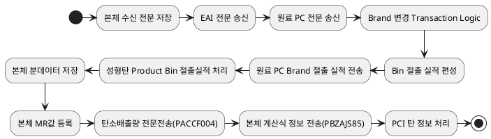
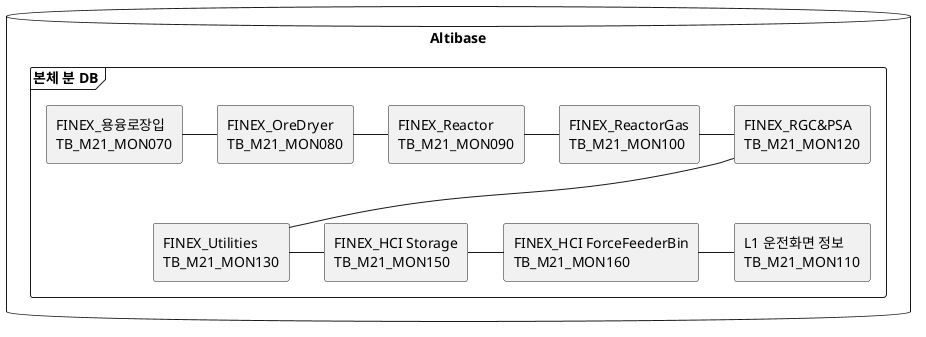

#### 1. 본체 분 주기 전문

```plantuml
@startuml
(*) -> "OPC"
->[ ] "L1 I/F"
->[소켓] "3Finex BPC"
->[EAI] "MES / Posframe"
-> (*)
@enduml
```

#### 2. 본체 분주기 3Finex BPC 처리 내역

```plantuml
@startuml


(*) -> "본체 수신 전문 저장"
-> "EAI 전문 송신"
-> "원료 PC 전문 송신"
-> "Brand 변경 Transaction Logic"
--> "Bin 절출 실적 편성"
-left-> "원료 PC Brand 절출 실적 전송"
-left-> "성형탄 Product Bin 절출실적 처리"
-left-> "본체 분데이터 저장"
--> "본체 MR값 등록"
-> "탄소배출량 전문전송(PACCF004)"
-> "본체 계산식 정보 전송(PBZAJS85)"
-> "PCI 탄 정보 처리"
-> (*)
@enduml
```

#### 3. 본체 분데이터 저장

```plantuml
@startuml
database "Altibase" as db1 {
  frame "본체 분 DB" {    
    rectangle "FINEX_용융로장입\nTB_M21_MON070"  as src1
    rectangle "FINEX_OreDryer\nTB_M21_MON080"  as src2
    rectangle "FINEX_Reactor\nTB_M21_MON090"  as src3
    rectangle "FINEX_ReactorGas\nTB_M21_MON100"  as src4
    rectangle "FINEX_RGC&PSA\nTB_M21_MON120"  as src5
    rectangle "FINEX_Utilities\nTB_M21_MON130"  as src6
    rectangle "FINEX_HCI Storage\nTB_M21_MON150"  as src7
    rectangle "FINEX_HCI ForceFeederBin\nTB_M21_MON160"  as src8
    rectangle "L1 운전화면 정보\nTB_M21_MON110"  as src9    
    src1-src2
    src2-src3
    src3-src4
    src4-src5
    src5--src6
    src6-src7
    src7-src8
    src8-src9
    
  }
}

@enduml
```
